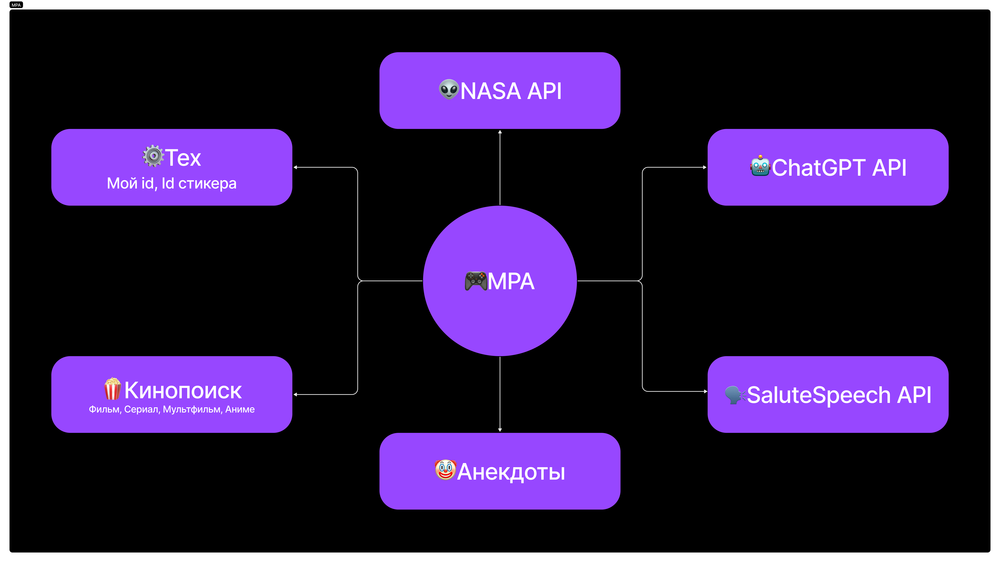
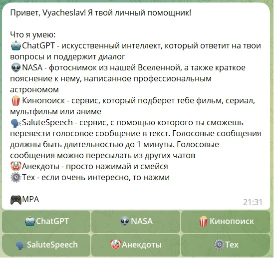

# MPA

## О боте

---

MPA or My Personal Assistant или Мой Личный Помощник - это телеграм бот, который предоставляет сервисы для твоего досуга!

Что может MPA?

🤖[ChatGPT API](https://openai.com/blog/introducing-chatgpt-and-whisper-apis) - искусственный интеллект, который ответит на твои вопросы и поддержит диалог

👽[NASA API](https://api.nasa.gov/) - фотоснимок из нашей Вселенной, а также краткое пояснение к нему, написанное профессиональным астрономом

🍿Кинопоиск - сервис, который подберет тебе фильм, сериал, мультфильм или аниме

🗣[SaluteSpeech API](https://developers.sber.ru/docs/ru/salutespeech/category-overview) - сервис, с помощью которого ты сможешь перевести голосовое сообщение в текст. Голосовые сообщения должны быть длительностью до 1 минуты. Голосовые сообщения можно пересылать из других чатов

🤡Анекдоты - расскажет анекдот

⚙Тех - узнать свой id или id стикера

Бот написан с использованием фреймворка [Aiogram](https://aiogram.dev/?amp=1).

Текста и данные для сервисов берутся из __json__ файлов, в папке __data__. Данные для сервиса __Кинопоиск__ и __Анекдоты__ собраны с парсера - `src/scripts/script.py`

К боту подключены 2 базы данных, PostgreSQL и MongoDB. При входе в бота данные записываются в PostgreSQL, входы в сервисы записываются в MongoDB.

## Как запустить?

---

1. Получи доступ к API:
   - 🎮[Telegram Bot API](https://core.telegram.org/bots/api)
   - 🤖[ChatGPT API](https://openai.com/blog/introducing-chatgpt-and-whisper-apis)
   - 👽[NASA API](https://api.nasa.gov/)
   - 🗣[SaluteSpeech API](https://developers.sber.ru/docs/ru/salutespeech/category-overview)
2. Создай файл __.env__
3. Добавь свои параметры БД(PostgreSQL, MongoDB)
   - необязательно добавлять свои параметры БД, для тестирования можно использовать уже указанные параметры
   - MongoDB - методы для работы с БД, `src/packages/database/mongodb/database.py`
   - PostgreSQL - методы для работы с БД, `src/packages/database/postgresql/database.py`
   - [PgAdmin](https://www.pgadmin.org/) - нужен для работы с PostgreSQL
     - создай БД с именем "mpa"
   - [MongoDB Community Server](https://www.mongodb.com/try/download/community) - нужен для работы с MongoDB
     - Логин и пароль не нужен, используй стандартное соединение `mongodb://localhost:27017`
4. Установи библиотеки - `pip install -r requirements.txt`
5. Запусти бота - `python -m src.main`

## Docker

---

1. Получи доступ к API:
   - 🎮[Telegram Bot API](https://core.telegram.org/bots/api)
   - 🤖[ChatGPT API](https://openai.com/blog/introducing-chatgpt-and-whisper-apis)
   - 👽[NASA API](https://api.nasa.gov/)
   - 🗣[SaluteSpeech API](https://developers.sber.ru/docs/ru/salutespeech/category-overview)
2. Создай файл __.env__
3. Cобери образ `docker build -t mpa:1 .`
4. Запусти __docker-compose__ `docker-compose up`
5. Как смотреть данные в БД:
   - PostgreSQL - введи в браузере адрес `localhost:8080`
     - Для тестирования: Сервер: postgres, Имя пользователя:postgres, Пароль: password, База данных: mpa
   - MongoDB - введи в браузере адрес `localhost:8081`

